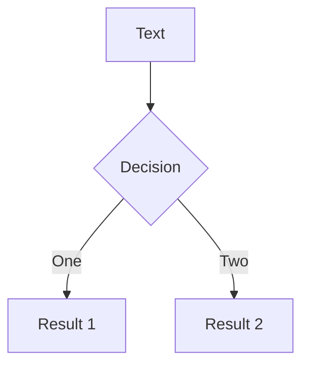
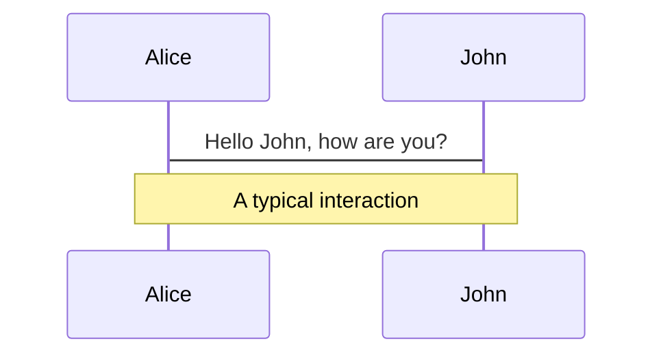

# Page 2        

hello world  2      

```ts {monaco}
console.log('HelloWorld')
```

::right::

# Page right 

$$ {all}
1+1=2
$$

<!-- 一个备注 -->

---  
layout: cover
---

<h1 flex="~ col">
<div text-2xl origin-top-left transition duration-500 :class="$clicks <= 2 ? 'scale-150' : 'op50'">
  <span v-click>Anthony's Roads to </span>
  <span>Open Source </span>
  <sup v-click>1/n</sup>
</div>
<div mt1 forward:delay-300 v-click>The Set Theory</div>
</h1>

---  
layout: cover
---

<div flex="~ col items-center gap-2" text-3xl p4>
  <div v-click="1" :class="$clicks >= 2 ? 'op50 duration-800 scale-90' : ''" transition v-mark.purple.linethrough="2">Opinionated Vue Tooling</div>
  <div v-click="2" text-4xl>Framework-agnostic Front-end Tooling</div>
</div>    

---

## Benefits of being Universal

<div h-100 flex="~ items-center">
<v-clicks>

- Larger user base

- More contributors working together
- Less fragmentation and maintenance cost
- Better abstraction and architecture
- Benefit the whole ecosystem

</v-clicks>
</div>

---     



